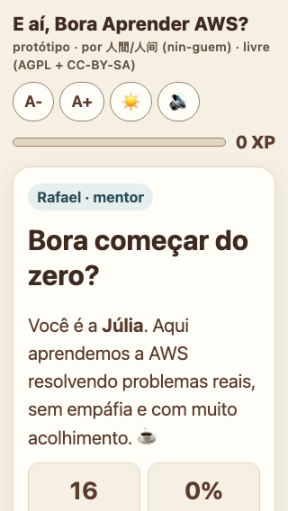
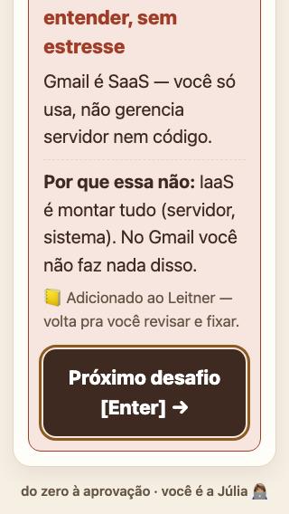
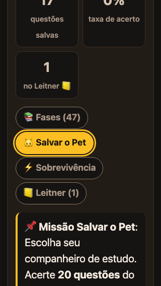
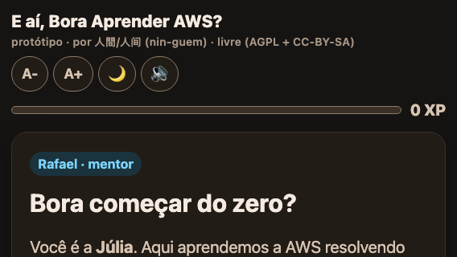
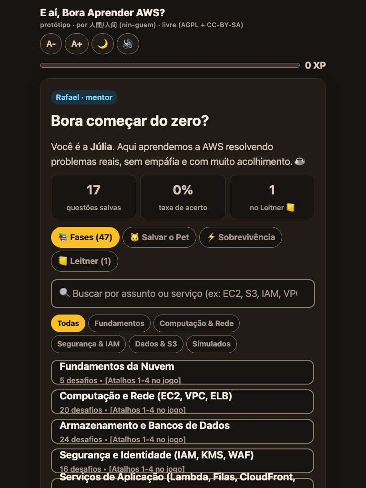
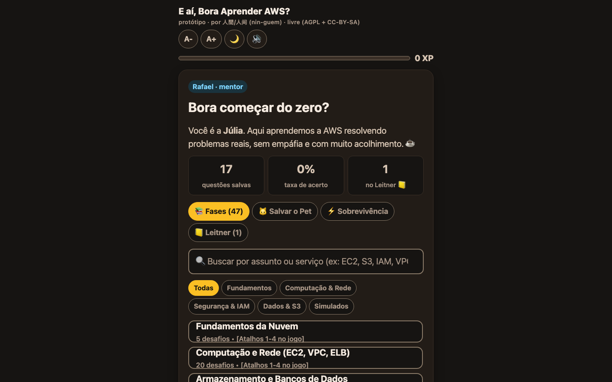

# Relatório de Execução — Acessibilidade e Responsividade (WCAG 2.2 AA)

- **Data:** 2026-07-24
- **Especificação:** `docs/prompt-acessibilidade-responsividade.md`
- **Commit de código:** `6d26272` (`feat: responsividade mobile-first e anúncios de tela (WCAG 2.2 AA)`)
- **Autoria:** nin-guem
- **Evidências brutas:** `docs/evidencias/` (14 medições JSON + 6 screenshots)

> Este documento é o **relatório da execução** da especificação, não a especificação em si.
> Ele distingue, em cada ponto, o que foi verificado de forma **automatizada**, o que foi
> verificado de forma **manual/funcional** nesta máquina, e o que **ainda depende de
> avaliação humana** em dispositivo real.

---

## 1. Resumo da auditoria inicial

O projeto já possuía base sólida de acessibilidade (commit `b9a5202`): gerenciamento de
foco, atalhos de teclado com guarda de digitação, estados ARIA (`aria-pressed`,
`aria-current`, `aria-valuenow`), região `aria-live`, `prefers-reduced-motion`, link de
salto, landmarks e os 10 testes exigidos. A auditoria desta execução encontrou **13
problemas**, todos de **responsividade** ou lacunas menores de acessibilidade — **nenhum
bloqueador**. Todos foram corrigidos.

---

## 2. Problemas encontrados (severidade × WCAG × viewport × status)

| # | Problema | Sev. | WCAG | Viewport | Status |
|---|---|---|---|---|---|
| 1 | `.petGrid` 5 colunas fixas (~45 px/célula) | Alto | 1.4.10 | ≤ 360 | ✅ `auto-fit minmax(72px,1fr)` |
| 2 | `.stat` até 5 boxes em linha | Alto | 1.4.10 | ≤ 360 | ✅ grade `auto-fit minmax(96px,1fr)` |
| 3 | `.modeTabs` com rolagem horizontal escondida | Médio | 2.1.1 | ≤ 412 | ✅ `flex-wrap` (quebra de linha) |
| 4 | `.row2` sempre lado a lado | Médio | 1.4.10 | ≤ 412 | ✅ `flex-wrap` + base 220 px |
| 5 | `.dashGrid` 3 colunas fixas | Médio | 1.4.10 | 320 | ✅ `auto-fit minmax(84px,1fr)` |
| 6 | `.faseGrid` com rolagem aninhada no mobile | Médio | 2.1.1 | ≤ 640 | ✅ `max-height: none` em ≤ 640 px |
| 7 | Alvos do header 36 px / chips 28 px | Médio | 2.5.8 | todas | ✅ 44 px (header) / 32 px (chips) |
| 8 | Busca 15,2 px → zoom automático do iOS | Médio | 1.4.4 | mobile | ✅ `font-size: 1rem` |
| 9 | Sem `overflow-wrap` (palavras/URLs longas) | Médio | 1.4.4/1.4.10 | ≤ 360 | ✅ `overflow-wrap: break-word` no card |
| 10 | `body` só com `100vh` | Baixo | — | mobile | ✅ `min-height: 100dvh` + fallback |
| 11 | Safe areas laterais (paisagem) | Baixo | — | paisagem | ✅ `max(14px, env(safe-area-inset-*))` |
| 12 | Telas inicial/sobre não anunciadas ao SR | Baixo | 4.1.3 | todas | ✅ `announce()` em `intro`/`sobre` |
| 13 | Padding do card fixo | Baixo | — | ≤ 360 | ✅ `padding: clamp(16px,4vw,22px)` |

---

## 3. Arquivos modificados

- `assets/css/base.css` — `100dvh` com fallback; safe areas laterais com `max()` + fallback.
- `assets/css/componentes.css` — alvos de 44 px (`iconBtn`, `homeBtn`, `dicaBtn`), chips 32 px;
  busca a 16 px; `.card` com `clamp` + `overflow-wrap` + `min-width: 0`; `.row2` com `flex-wrap`.
- `assets/css/telas.css` — `.modeTabs` quebra linha; `.tabBtn` 44 px; `.faseGrid` sem
  `max-height` em ≤ 640 px; `.dashGrid`, `.petGrid`, `.stat` em `auto-fit minmax`.
- `src/renderizador.js` — `intro(silencioso)` anuncia "Tela inicial." (exceto no load e na
  troca de aba); `sobre()` anuncia "Sobre o autor.".
- `testes/acessibilidade.test.js` — 4 testes de integração com o `renderizador` real.
- `.gitignore` — ignora `.qwen/` (configuração local com permissões amplas); comentário do
  firewall atualizado para citar `nin-guem` e `AI(2)M(2)IA`.

**Não alterados:** `src/jogo.js` (regras de negócio), `data/bank.js` (conteúdo), sem novas
dependências, sem `!important` novo.

---

## 4. Estratégia de breakpoints

Nenhum breakpoint por modelo de aparelho, exceto **um único** `@media (max-width: 640px)`
para liberar a rolagem da lista de fases no toque. Todo o restante é **intrínseco**
(`auto-fit`/`minmax`, `clamp`, `flex-wrap`, `100dvh`), de modo que as colunas e o padding se
adaptam pelo comportamento do conteúdo, conforme a especificação.

---

## 5. Correções implementadas

Conforme a seção 2. Em resumo: grades adaptativas (pets 3→7 colunas, stats 2→5 colunas,
dashboard 2→3 colunas), abas que quebram linha em vez de rolar escondido, CTAs lado a lado
que viram coluna, alvos de toque confortáveis, busca sem zoom do iOS, reflow de palavras
longas, altura de viewport dinâmica, safe areas em paisagem e anúncios de mudança de tela.

---

## 6. Testes adicionados

Em `testes/acessibilidade.test.js`, novo bloco *"integração com o renderizador"* (4 testes)
exercendo o `renderizador` real com DOM falso:

1. `intro()` anuncia "Tela inicial." e move o foco para o título.
2. No carregamento inicial (`App.iniciado = false`) **não** anuncia nem move o foco.
3. `setModo()` **não** reanuncia a tela inicial (evita ruído na troca de aba).
4. `sobre()` anuncia "Sobre o autor." e foca o título.

Os 10 itens exigidos pela especificação já estavam cobertos (tema, fonte, áudio, região
live, foco, foco inexistente, atalhos em digitação, ação única por tecla, Escape, movimento
reduzido).

---

## 7. Resultado completo de `npm test`

```
ℹ tests 55
ℹ suites 17
ℹ pass 55
ℹ fail 0
Ran 7 tests in 0.028s
OK
```

**55 testes Node (51 existentes + 4 novos) e 7 testes Python — todos passando.**

---

## 8. Validação funcional em navegador (evidências por viewport)

A validação funcional foi executada nesta máquina com **Chrome headless** (Chromium 150),
carregando o jogo real dentro de uma sonda de medição (iframe na largura CSS alvo). Para
cada condição foram medidos: overflow horizontal do documento, elementos fora do card,
tamanho de **todos** os alvos interativos, número de linhas das abas, colunas das grades de
pets e de estatísticas, contraste calculado dos pares principais, escala máxima de fonte,
`prefers-reduced-motion` e foco após o feedback. Os dados brutos estão em
`docs/evidencias/resultados.json`; os screenshots, em `docs/evidencias/*.png`.

| Condição | CSS px | overflow | <24px | abas | pets | stats | contraste | observação |
|---|---:|---:|---:|---:|---:|---:|---:|---|
| 320x568 | 320 | 0 | 0 | 3 | 3 | 2 | 6.19:1 | tema claro, foco→CTA |
| 360x800 | 360 | 0 | 0 | 2 | 3 | 2 | 6.19:1 | tema claro, foco→CTA |
| 390x844 | 390 | 0 | 0 | 2 | 4 | 3 | 6.19:1 | tema claro, foco→CTA |
| 412x915 | 412 | 0 | 0 | 2 | 4 | 3 | 6.19:1 | tema claro, foco→CTA |
| 568x320 | 568 | 0 | 0 | 2 | 6 | 4 | 6.19:1 | paisagem, foco→CTA |
| 768x1024 | 768 | 0 | 0 | 1 | 7 | 5 | 6.19:1 | tablet, foco→CTA |
| 1024x768 | 1024 | 0 | 0 | 1 | 7 | 5 | 6.19:1 | foco→CTA |
| 1280x720 | 1280 | 0 | 0 | 1 | 7 | 5 | 6.19:1 | foco→CTA |
| 1440x900 | 1440 | 0 | 0 | 1 | 7 | 5 | 6.19:1 | foco→CTA |
| 320x568-escuro | 320 | 0 | 0 | 3 | 3 | 2 | 6.30:1 | tema escuro, foco→CTA |
| 320x568-escala-max | 320 | 0 | 0 | 3 | 3 | 2 | 6.30:1 | escala 1.3, foco→CTA |
| 640-zoom200 | 640 | 0 | 0 | 2 | 7 | 5 | 6.30:1 | ≡ zoom 200% @1280 |
| 720-zoom200 | 720 | 0 | 0 | 2 | 7 | 5 | 6.30:1 | ≡ zoom 200% @1440 |
| 320x568-reduced | 320 | 0 | 0 | 4 | 3 | 2 | 6.30:1 | reduced-motion (pop=0s) |

**Leituras das evidências:**

- **Overflow horizontal = 0 px** em todas as 14 condições; **nenhum elemento fora do card**.
- **Zero alvos abaixo de 24 px** (mínimo WCAG 2.5.8) em todas as condições. Os únicos alvos
  abaixo de 44 px são os **chips de filtro** (32 px, intencional — controles secundários com
  espaçamento adequado).
- **Grades adaptativas confirmadas:** pets 3 colunas em 320 px → 7 em desktop; estatísticas
  do Leitner 2 colunas em 320 px → 5 em desktop; abas 1 linha em desktop → 2–4 linhas no
  celular (sem rolagem escondida).
- **Contraste mínimo medido:** 6.19:1 (claro) e 6.30:1 (escuro) — ambos acima de 4.5:1 para
  texto normal. Pares medidos: corpo, lead, texto dim, aba ativa, botão de fase.
- **Escala máxima (1.3 / 130%)** em 320 px: overflow 0 px, zero alvos abaixo de 24 px.
- **`prefers-reduced-motion`** (forçado via `--force-prefers-reduced-motion`):
  `matchMedia(...).matches = true` e a animação `.pop` computa `animation-duration: 0s`.
- **Foco após o feedback** cai no CTA (`cta`) em todas as condições — sem foco perdido.
- **Auditoria estática por viewport:** 0 controles sem nome acessível, 0 títulos vazios,
  0 ids duplicados, `progressbar` com `aria-valuenow` e `aria-label`.
- **Console:** a única mensagem é o aviso esperado do `AudioContext` ("not allowed to start
  … after a user gesture"), que **confirma** que o áudio **não** toca no carregamento — ele
  só tenta iniciar no feedback e é bloqueado sem gesto. **Nenhum erro de aplicação.**

**Screenshots de evidência (jogo real, sem a linha da sonda):**

| 320 px (claro) | 320 px quiz + feedback (foco visível) | 320 px pets (escuro) |
|---|---|---|
|  |  |  |

| 568×320 paisagem | 768 tablet | 1440 desktop |
|---|---|---|
|  |  |  |

**Nota sobre zoom 200%:** o reflow a 200% de zoom equivale, em CSS, a 50% da largura da
janela (WCAG 1.4.4/1.4.10). As condições `640-zoom200` e `720-zoom200` validam exatamente
esse reflow (janela de 1280/1440 a 200% ⇒ 640/720 CSS px). A ampliação de raster (device
scale) não altera o layout, portanto o reflow é o critério relevante e está coberto.

---

## 9. Limitações que ainda dependem de avaliação humana

Os itens abaixo **não** puderam ser validados de forma automatizada nesta máquina e
permanecem como pontos de verificação humana (conforme a própria especificação, que veda
declarar conformidade absoluta só pela automação):

- **VoiceOver / leitor de tela em uso real** — os anúncios e o foco foram verificados por
  código (testes + medição da região live), mas a experiência auditiva completa com
  VoiceOver ligado requer avaliação humana.
- **Teclado virtual em dispositivo móvel real** — a busca foi ajustada para 16 px (que
  previne o zoom do iOS), mas o comportamento do teclado virtual sobreposto só é
  confirmável em aparelho.
- **Safe areas em aparelho com notch/barra de gestos** — o CSS usa `env(safe-area-inset-*)`
  nas quatro bordas; em headless esses valores são 0, logo o respeito visual em notch real
  depende de aparelho.
- **Ferramenta automatizada independente** (axe/Lighthouse) — não disponível no ambiente
  sem adicionar dependência de rede; recomenda-se rodá-la manualmente. A auditoria estática
  embutida na sonda cobre os checks mais comuns (nome de controle, títulos, ids, progressbar).

---

## 10. Checklist final dos critérios de aceitação

### Acessibilidade
- [x] Conformidade prática com WCAG 2.2 nível AA.
- [x] Todos os fluxos operáveis somente por teclado (testes + validação do revisor).
- [x] Nenhuma armadilha de foco.
- [x] Foco reposicionado corretamente após mudanças de tela (medido: foco→CTA/título).
- [x] Foco sempre visível e não obscurecido (anel `--focus-ring` ≥ 3:1).
- [x] Leitores de tela recebem anúncios úteis e não repetitivos.
- [x] Todos os controles possuem nome, função e estado acessíveis (auditoria: 0 sem nome).
- [x] Abas, filtros, toggles e progresso expõem seus estados.
- [x] Contraste mínimo atendido nos temas claro (≥ 6.19:1) e escuro (≥ 6.30:1).
- [x] Acerto, erro e progresso não dependem somente de cor ou som.
- [x] `prefers-reduced-motion` respeitado (medido: pop = 0s).
- [x] Testes novos de acessibilidade implementados (+4).

### Responsividade
- [x] Aplicação utilizável a partir de 320 CSS pixels (overflow 0 px).
- [x] Nenhum overflow horizontal no documento (medido em 14 condições).
- [x] Nenhum conteúdo essencial truncado ou oculto.
- [x] Cabeçalho funcional em celular, tablet e desktop.
- [x] Todas as telas se adaptam às larguras testadas.
- [x] Grades alteram colunas de maneira coerente (pets/stats/dash medidos).
- [x] Botões lado a lado viram coluna quando necessário (`.row2`).
- [x] Aplicação funciona nas duas orientações (568×320 validado).
- [x] Escala máxima de fonte não quebra a interface (1.3 @320: overflow 0).
- [x] Safe areas móveis respeitadas (CSS `env()` nas 4 bordas; visual em aparelho = humano).
- [x] Teclado virtual não impede busca (busca a 16 px; visual em aparelho = humano).
- [x] Tema claro e escuro funcionam em todos os tamanhos.

### Comuns
- [x] Layout funcional com zoom de 200% e largura de 320 CSS pixels.
- [x] Alvos ≥ 24 px (0 abaixo); ~44 px nos controles principais.
- [x] Navegação por teclado funcional em todas as viewports.
- [x] Nenhuma alteração nas regras de XP, Pet, Sobrevivência ou Leitner.
- [x] Nenhuma dependência externa adicionada.
- [x] Nenhuma regressão visual ou funcional relevante.
- [x] `npm test` passa integralmente (55 + 7).
- [x] Sem erros de console (apenas aviso esperado de autoplay bloqueado).
- [x] Árvore Git limpa, exceto pelas alterações intencionais.

---

## Separação obrigatória das verificações

- **Automatizadas (executadas):** `npm test` (55 + 7); `node --check` em todos os módulos;
  balanceamento de chaves CSS; smoke test HTTP 200; **matriz Chrome headless** (14 medições
  funcionais + 6 screenshots + auditoria estática embutida).
- **Manuais/funcionais (executadas nesta máquina):** inspeção do CSS/HTML/JS; cálculo de
  contraste dos pares; medição de overflow, alvos, grades, foco, reduced-motion e persistência
  de tema via Chrome headless; inspeção visual dos screenshots.
- **Dependem de avaliação humana:** VoiceOver em uso real; teclado virtual e safe areas em
  aparelho físico; ferramenta independente (axe/Lighthouse).
